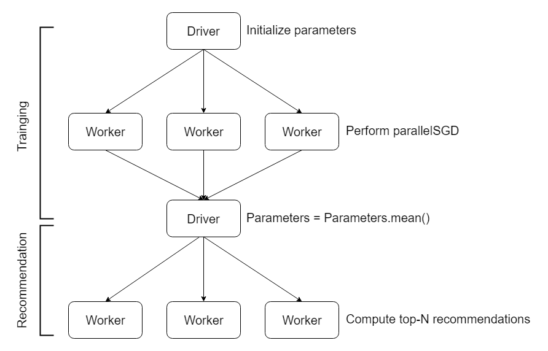

# PySpark implementation of SVD++ for Top-N Recommendation



## Getting Started

### Prerequisites

You need to install *Apache Hadoop* and *Apache Spark* on every nodes of the cluster.

#### Install Hadoop

```bash
tar zxvf hadoop-3.y.z.tgz
ln -s /your/hadoop/path/hadoop-3.x.z /your/hadoop/path/hadoop
```

#### Install Spark

```bash
tar zxvf spark-2.y.z-bin-hadoop2.7.tgz
ln -s /your/spark/path/spark-2.y.z /your/spark/path/spark
```

### Installing

#### Clone the repository

```bash
git clone git@bitbucket.org:citomhuang/spark_svdpp.git
```

#### Create the Python environment

```bash
cd spark_svdpp
conda env create -f conda.yaml
conda activate spark-svdpp-env
```

#### Run the tests

```bash
pytest spark_svdpp/tests
```

## Run a example

```bash
./yarn-client.sh
```

## References

1. [Factorization Meets the Neighborhood: A Multifaceted Collaborative Filtering Model. Yehuda Koren, KDD’08](https://www.cs.rochester.edu/twiki/pub/Main/HarpSeminar/Factorization_Meets_the_Neighborhood-_a_Multifaceted_Collaborative_Filtering_Model.pdf)

2. [Spark: Cluster Computing with Working Sets](https://www.usenix.org/legacy/event/hotcloud10/tech/full_papers/Zaharia.pdf)

3. [Scaling Collaborative Filtering with PySpark](https://engineeringblog.yelp.com/2018/05/scaling-collaborative-filtering-with-pyspark.html)

4. [Running Spark on YARN](https://spark.apache.org/docs/latest/running-on-yarn.html)

5. [NicolasHug/Surprise](https://github.com/NicolasHug/Surprise)
